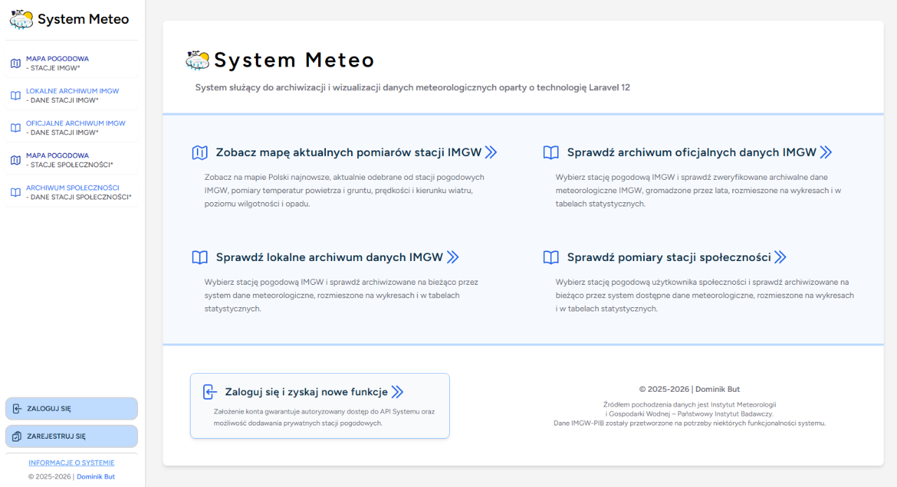
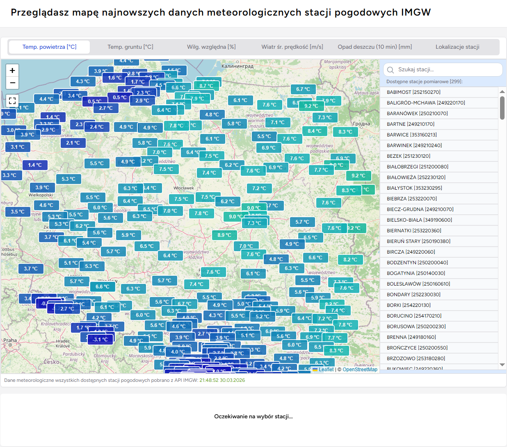
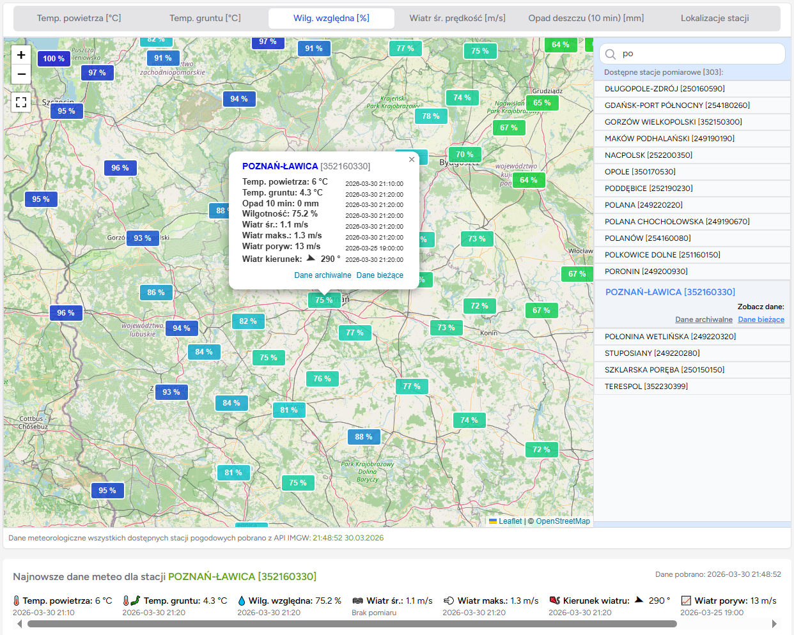
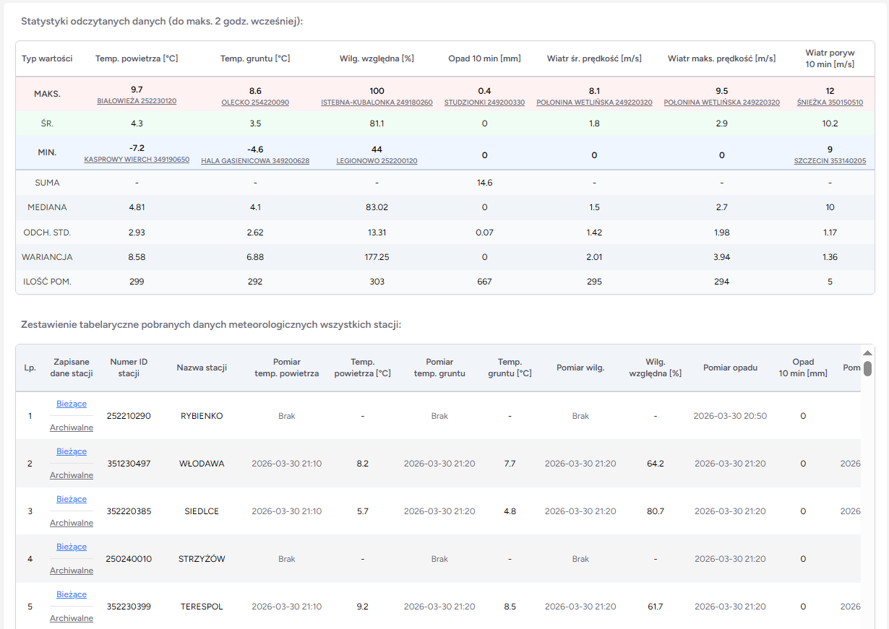
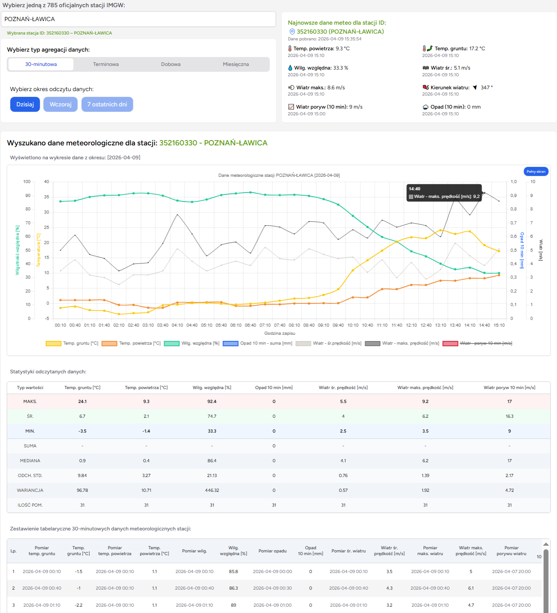
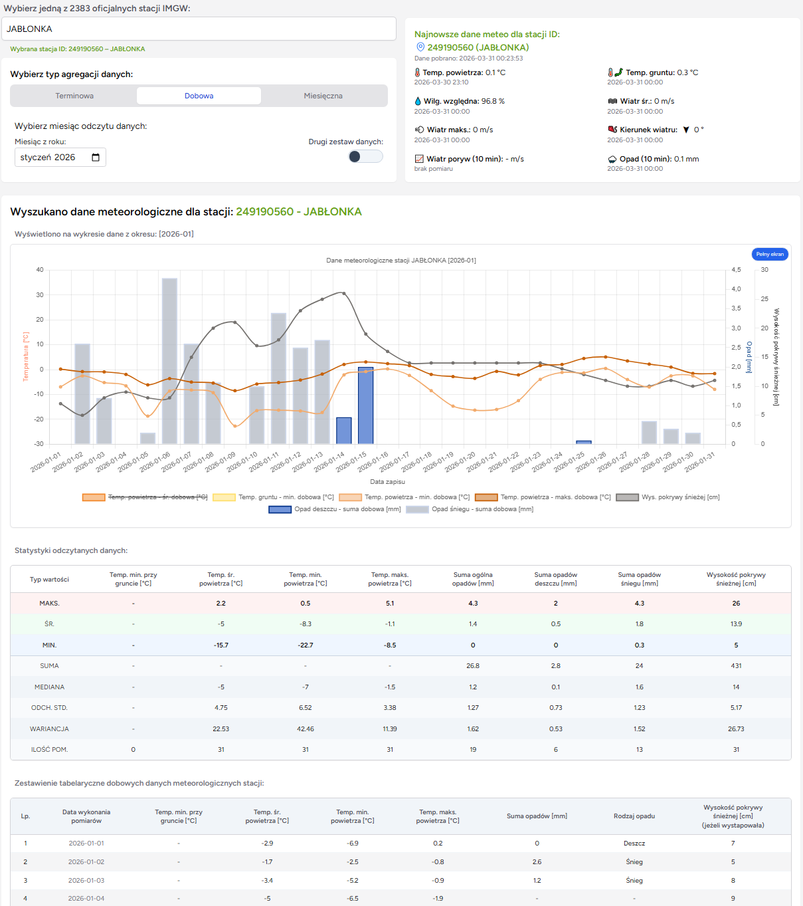
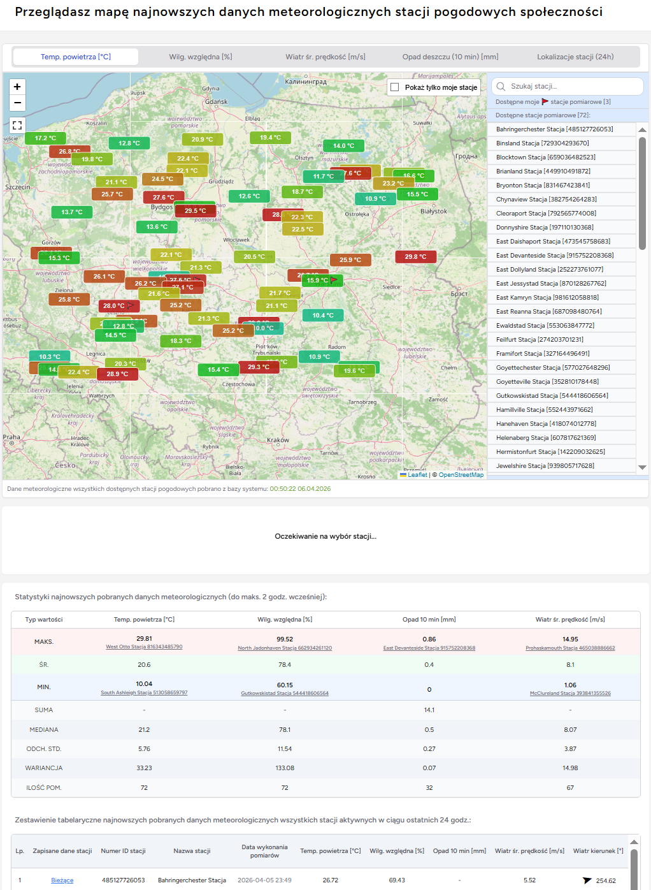
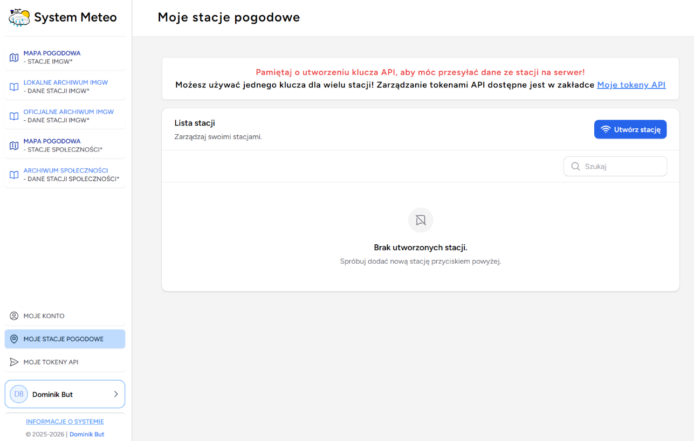
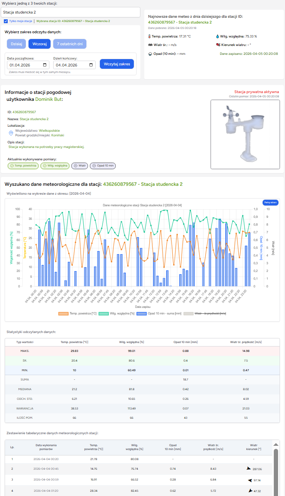
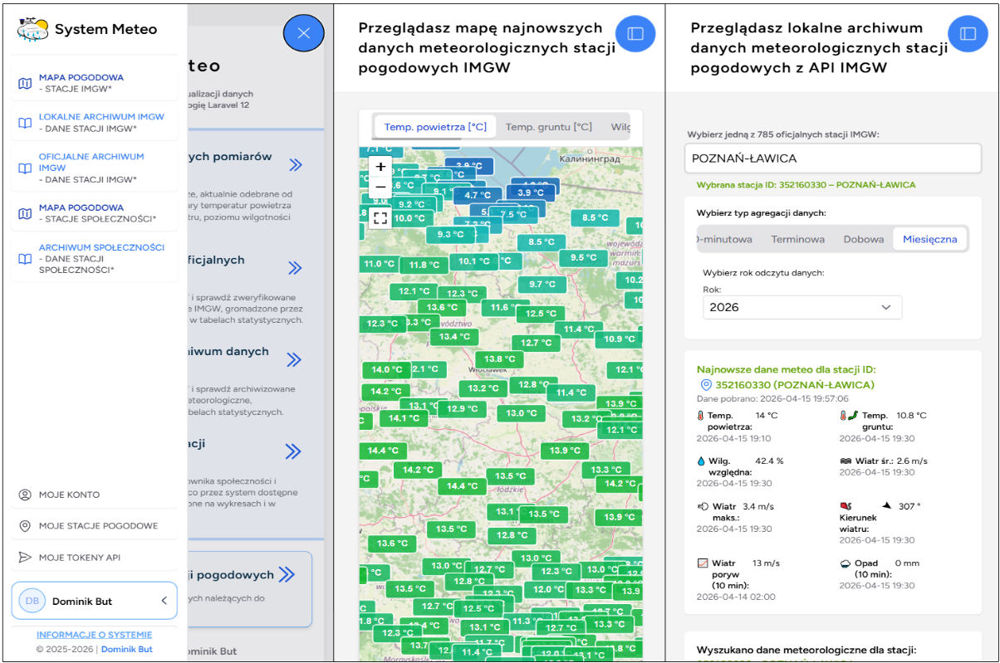

# SystemMeteo

<p align="center">
  
</p>

<h3 align="center">
  System archiwizacji i wizualizacji danych meteorologicznych
</h3>

<p align="center">
  Autorska aplikacja internetowa opracowana w ramach pracy magisterskiej
</p>

<p align="center">
  <a href="#o-projekcie">O projekcie</a> •
  <a href="#funkcjonalności">Funkcjonalności</a> •
  <a href="#technologie">Technologie</a> •
  <a href="#instalacja">Instalacja</a> •
  <a href="#dane">Dane</a> •
  <a href="#licencja">Licencja</a>
</p>

---

## O projekcie

**SystemMeteo** to autorski system oparty na Laravel 12 przeznaczony do **gromadzenia, archiwizacji, przetwarzania, analizy oraz wizualizacji danych meteorologicznych**.

Projekt został opracowany jako część pracy magisterskiej:

> **„System archiwizacji i wizualizacji danych meteorologicznych oparty na technologii Laravel”**

Głównym założeniem systemu jest umożliwienie analizy danych meteorologicznych pochodzących z oficjalnych stacji **IMGW-PIB** oraz danych udostępnianych przez użytkowników posiadających własne stacje pogodowe.

Aplikacja umożliwia zarówno dostęp do bieżących pomiarów, jak i analizę danych historycznych. 

Dane prezentowane są między innymi w postaci:

* interaktywnych map,
* wykresów,
* zestawień tabelarycznych,

SystemMeteo to także rozwiązanie wieloużytkownikowe, umożliwiające również rejestrowanie własnych stacji pogodowych i przesyłanie przez nie pomiarów do serwera.

---

## Funkcjonalności

### Dane IMGW

**System współpracuje z [publicznymi zasobami Instytutu Meteorologii i Gospodarki Wodnej – Państwowego Instytutu Badawczego.](https://danepubliczne.imgw.pl/pl/introduction)**

**Dane IMGW-PIB zostały przetworzone na potrzeby niektórych funkcjonalności systemu.**

Wykorzystywane są między innymi:

* [bieżące dane meteorologiczne pobierane przez publiczne API IMGW](https://danepubliczne.imgw.pl/api/data/meteo/),
* [archiwalne dane meteorologiczne z publicznego repozytorium danych pomiarowo-obserwacyjnych IMGW](https://danepubliczne.imgw.pl/data/dane_pomiarowo_obserwacyjne/dane_meteorologiczne/)
<br>(dane: "terminowe/klimat/", "dobowe/klimat/", "miesieczne/klimat/"),
* [wykaz stacji meteorologicznych IMGW](https://danepubliczne.imgw.pl/data/dane_pomiarowo_obserwacyjne/dane_meteorologiczne/wykaz_stacji.csv),

Dane archiwalne IMGW są wykorzystywane w formacie CSV, natomiast bieżące dane API są przetwarzane w formacie JSON.


### Automatyczna archiwizacja danych IMGW

System automatycznie pobiera aktualne dane od API IMGW i zapisuje je lokalnie w postaci przetworzonych plików JSON.

Proces archiwizacji został oparty na zadaniu Laravel Artisan uruchamianym cyklicznie przez mechanizm Cron. <br>W opracowanym wdrożeniu dane są pobierane co 30 minut.

Dane są następnie przetwarzane do kilku poziomów agregacji:

* 30-minutowej,
* terminowej,
* dobowej,
* miesięcznej.


---

### Mapa pomiarów IMGW

**Mapa aktualnych danych meteorologicznych IMGW IMGW**
<p align="center">
  
</p>

**Wariant mapy aktualnych danych meteorologicznych IMGW**
<p align="center">
  
</p>

**Zestawienie tabelaryczne odebranych danych IMGW**
<p align="center">
  
</p>

System umożliwia prezentowanie aktualnych danych meteorologicznych wszystkich dostępnych stacji IMGW na interaktywnej mapie OpenStreetMap.

Użytkownik może między innymi:

* wybierać prezentowany parametr meteorologiczny,
* wyszukiwać stacje,
* wyświetlać szczegółowe pomiary,
* przeglądać lokalizacje stacji,
* korzystać z trybu pełnoekranowego mapy,
* przechodzić bezpośrednio do archiwów wybranych stacji.

Mapa wykorzystuje bibliotekę Leaflet.js, a dane są przekazywane do warstwy wizualnej za pośrednictwem komponentów Livewire.

---

### Archiwum danych IMGW

**Lokalne archiwum danych meteorologicznych IMGW**
<p align="center">
  
</p>

**Oficjalne archiwum danych meteorologicznych IMGW**
<p align="center">
  
</p>

System pozwala na analizowanie lokalnie i oficjalnie archiwizowanych danych meteorologicznych.

Dostępne są między innymi:

* wybór stacji meteorologicznej,
* wybór zakresu czasowego,
* wybór poziomu agregacji,
* prezentacja danych w zestawieniach tabelarycznych,
* wizualizacja danych na wykresach,
* obliczanie statystyk opisowych.

---

### Stacje pogodowe użytkowników

System umożliwia użytkownikom tworzenie własnych stacji pogodowych.

Dla stacji można określić między innymi:
* obsługiwane parametry pomiarowe,
* status aktywności,
* status publiczności.

Archiwizowane dane stacji użytkowników są przechowywane w bazie danych systemu.

### Mapa stacji społeczności

<p align="center">
  
</p>

Dane stacji użytkowników mogą być prezentowane na mapie, przy czym system rozróżnia stacje publiczne i prywatne.

Stacje publiczne mogą być przeglądane przez innych użytkowników, natomiast dane stacji prywatnych pozostają dostępne wyłącznie dla ich właściciela.

---

### API dla własnych stacji pogodowych

**Lista stacji pogodowych użytkownika - centrum konfiguracji**
<p align="center">
  
</p>

**Przykładowa stacja pogodowa dodana przez użytkownika**
<p align="center">
  
</p>

System udostępnia dedykowany interfejs umożliwiający przesyłanie danych pomiarowych z własnych stacji pogodowych:

```text
POST /api/data
```

Żądanie wymaga autoryzacji za pomocą tokenu API tworzonego w zakładce **Moje tokeny API** przesyłanego w nagłówku:

```http
Authorization: Bearer <API_TOKEN>
```

Przykładowe dane:

```json
{
    "station_id": 1,
    "temp_air": 21.4,
    "humidity": 64.2,
    "wind_speed": 3.5,
    "wind_direction": 245,
    "rain_10min": 0.4
}
```

Obsługiwane są między innymi:

| Parametr                  | Jednostka |
| ------------------------- | --------- |
| Temperatura powietrza     | °C        |
| Wilgotność względna       | %         |
| Prędkość wiatru           | m/s       |
| Kierunek wiatru           | °         |
| Opad z ostatnich 10 minut | mm        |

Interfejs wykonuje walidację przesłanych danych, uwierzytelnienie tokenem, weryfikację właściciela stacji oraz sprawdzenie jej aktywności przed zapisaniem pomiaru.

---

### Konta użytkowników

System posiada mechanizm rejestracji i uwierzytelniania użytkowników.

Zalogowani użytkownicy mogą między innymi:

* zarządzać własnym kontem,
* tworzyć stacje pogodowe,
* generować tokeny API,
* zarządzać stacjami,
* przeglądać własne dane,
* decydować o publiczności stacji.

Mechanizmy uwierzytelniania i zarządzania kontami zostały zrealizowane z wykorzystaniem Laravel Jetstream.

---

### Analizy statystyczne

System umożliwia wykonywanie podstawowych analiz statystycznych zgromadzonych danych meteorologicznych.

W zależności od rodzaju danych obliczane są między innymi:

* minimum,
* maksimum,
* średnia,
* mediana,
* wariancja,
* odchylenie standardowe,
* suma,
* liczebność próby.

---

### Responsywność

<p align="center">
  
</p>

Interfejs systemu został przygotowany z uwzględnieniem różnych rozdzielczości ekranów.

---

## Technologie

| Technologia         | Wersja  |
| ------------------- | ------- |
| PHP                 | 8.2    |
| Laravel             | 12.0   |
| Laravel Jetstream   | 5.3    |
| Laravel Sanctum     | 4.0    |
| Laravel Livewire    | 3.0    |
| Filament Tables     | 3.3     |
| [Filament Map Picker](https://github.com/dotswan/filament-map-picker) | 1.8   |
| Tailwind CSS        | 3.4.17 |
| Vite                | 6.2.4  |
| Alpine.js           | 3.14.9 |
| Leaflet.js           | 1.9.4 |
| Leaflet.fullscreen   | 3.14.9 |
| Chart.js           | 4.5.0 |


### Baza danych

W testowej wersji wykorzystano **SQLite**. Silnik bazy można zmienić w pliku konfiguracyjnym `.env`.

---

## Instalacja

Do uruchomienia projektu wymagane są co najmniej:

* PHP 8.2,
* Composer,
* Node.js,
* npm,
* SQLite lub inny kompatybilny silnik bazy danych,
* *serwer WWW obsługujący PHP.
* minimum 2 GB przestrzeni dyskowej oraz 300 MB pamięci RAM dla przykładowego wdrożenia.

### 1. Klonowanie repozytorium

```bash
git clone https://github.com/DominikBut/SystemMeteo.git
cd SystemMeteo
```

### 2. Instalacja zależności PHP

```bash
composer install
```

### 3. Instalacja zależności JavaScript

```bash
npm install
```

### 4. Konfiguracja środowiska

Utwórz plik `.env` na podstawie:

```bash
cp .env.example .env
```

Następnie wygeneruj klucz aplikacji:

```bash
php artisan key:generate
```

### 5. Konfiguracja bazy danych

Dla SQLite:

```bash
touch database/database.sqlite
```

Następnie wykonaj migracje:

```bash
php artisan migrate
```

### 6. Uruchomienie Vite

W osobnym terminalu:

```bash
npm run dev
```

### 7. Uruchomienie aplikacji

```bash
php artisan serve
```

Aplikacja będzie dostępna lokalnie pod adresem:

```text
http://127.0.0.1:8000
```

---

### Automatyczna archiwizacja danych IMGW

System posiada mechanizm automatycznego pobierania i archiwizacji aktualnych danych meteorologicznych udostępnianych przez API IMGW.

Logika odpowiedzialna za pobieranie i przetwarzanie danych została zaimplementowana po stronie aplikacji za wykonanie właściwych operacji odpowiada Laravel Scheduler.

W środowisku produkcyjnym na hostingu współdzielonym wykorzystywany jest skrypt .sh, uruchamiany cyklicznie co 30 minut przez harmonogram zadań Cron.

Przykładowy skrypt:

```bash
#!/bin/bash
cd SystemMeteo && php83 artisan schedule:run
```
Skrypt uruchamia mechanizm Laravel Scheduler przy użyciu PHP 8.3.

Mechanizm archiwizacji:

```text
Hosting
   │
   │ co 30 minut
   ▼
.sh script
   │
   ▼
php artisan schedule:run
   │
   ▼
Laravel Scheduler
   │
   ▼
Żądanie HTTP
   │
   ▼
IMGW API
   │
   ▼
  JSON
   │
   ▼
Walidacja i przetwarzanie
   │
   ├──► agregacja 30-minutowa
   │
   ├──► agregacja terminowa
   │
   ├──► agregacja dobowa
   │
   └──► agregacja miesięczna
            │
            ▼
       lokalne archiwum
```

Proces został zaprojektowany tak, aby ograniczać liczbę niepotrzebnych zapisów oraz automatycznie zarządzać przestrzenią dyskową. Najstarsze dane 30-minutowe są usuwane po 7 dniach, podczas gdy dane bardziej zagregowane pozostają dostępne do dalszej analizy.

---

## Dane

Podstawowym źródłem oficjalnych danych meteorologicznych wykorzystywanych przez system jest:

**Instytut Meteorologii i Gospodarki Wodnej – Państwowy Instytut Badawczy (IMGW-PIB).**

**System współpracuje z [publicznymi zasobami Instytutu Meteorologii i Gospodarki Wodnej – Państwowego Instytutu Badawczego.](https://danepubliczne.imgw.pl/pl/introduction)**

**Dane IMGW-PIB zostały przetworzone na potrzeby niektórych funkcjonalności systemu.**

Wykorzystywane są między innymi:

* [bieżące dane meteorologiczne pobierane przez publiczne API IMGW](https://danepubliczne.imgw.pl/api/data/meteo/),
* [archiwalne dane meteorologiczne z publicznego repozytorium danych pomiarowo-obserwacyjnych IMGW](https://danepubliczne.imgw.pl/data/dane_pomiarowo_obserwacyjne/dane_meteorologiczne/)
<br>(dane: "terminowe/klimat/", "dobowe/klimat/", "miesieczne/klimat/"),
* [wykaz stacji meteorologicznych IMGW](https://danepubliczne.imgw.pl/data/dane_pomiarowo_obserwacyjne/dane_meteorologiczne/wykaz_stacji.csv),

Dane archiwalne IMGW są wykorzystywane w formacie CSV, natomiast bieżące dane API są przetwarzane w formacie JSON.

***Dane IMGW są udostępniane w ramach zasobów publicznych zgodnie z warunkami określonymi przez ich dostawcę. <br>Przy dalszym wykorzystaniu danych należy zachować wymagane oznaczenia źródła.***

### Ograniczenia

System jest zależny od dostępności zewnętrznych źródeł danych IMGW. Zmiana struktury API, niedostępność serwera lub ograniczenie dostępu do danych może wpłynąć na działanie funkcji odpowiedzialnych za pobieranie, archiwizację i wizualizację danych.

---

## Licencja

Kod źródłowy projektu jest udostępniany na licencji **MIT**.

Wymagane jest zachowanie informacji o prawach autorskich oraz treści licencji.

**Copyright © 2026 Dominik But**

Należy pamiętać, że licencja projektu **nie obejmuje automatycznie zewnętrznych bibliotek, frameworków, danych IMGW, map OpenStreetMap ani innych materiałów należących do osób trzecich**. Ich wykorzystanie podlega odpowiednim, odrębnym warunkom licencyjnym.

Projekt został zrealizowany z wykorzystaniem otwartego ekosystemu PHP i Laravel oraz bibliotek i narzędzi Open Source.

Szczególne znaczenie dla projektu miały:

* Laravel,
* Livewire,
* Filament,
* Jetstream,
* Leaflet.js,
* Chart.js,
* Alpine.js,
* Tailwind CSS,
* OpenStreetMap.

---

<p align="center">
  <b>SystemMeteo</b><br>
  System archiwizacji i wizualizacji danych meteorologicznych
</p>

